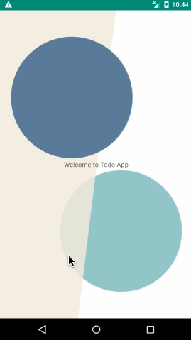
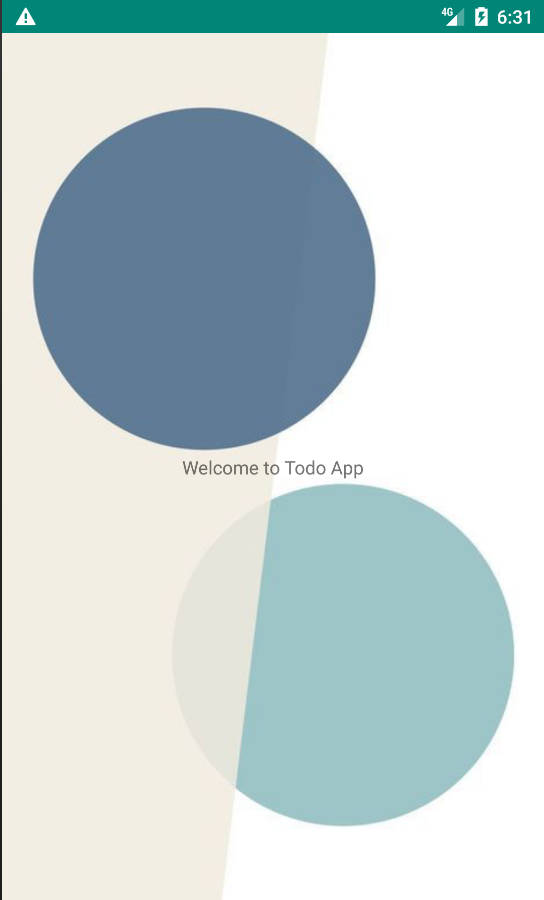
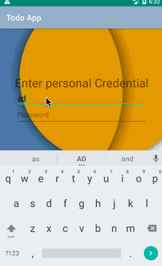
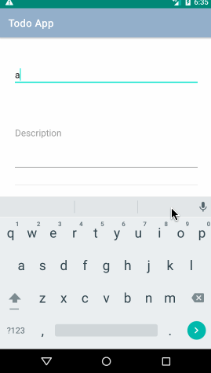
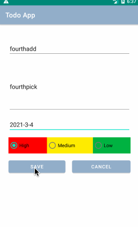
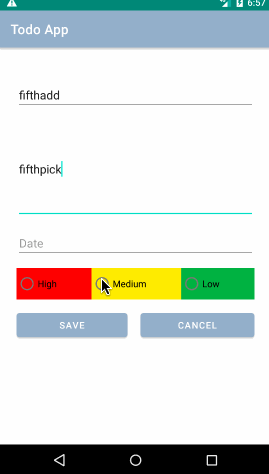

######Features of the App 

1.Enhanced splash screen 

2.User Login 

3.Add task where user can add tasks and save 

4.Notification sent when user adds a tasks 

5.Proper validation 

6.User can Edit/Update exisiting Tasks by double clicking the particular task and modifying it  
6. Straight away the user can click cancel in order to not updating.  
6.User can click delete option to delete particular Task 
7.Delete all task where user can delete all tasks from the right top menu option. 
8.User can logout by clicking the logout option from the right top menu.

######Installation and User Guide 

1.Install the app and run the app 
2.Login using your username and password 
3.Click on floating action button to add new tasks 
4. You can see the list of task your have added on the screen. 
5. To update click on the task and edit the information and press update button. 
6. You can cancel by clicking cancel button in case you dont feel like updating. 
7. Click delete option to delete a particular task 
8. Go to option and click delete all to delete all task. 
9. Go to option >> logout to log out from the app. 
---
##Design Architecture
---
* `Model`   
* `View`   
* `ViewModel`   
---

##Databse Used
* `Model`
